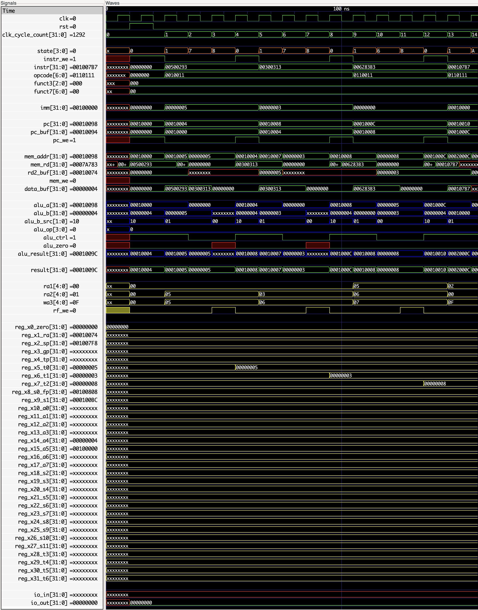

# RISCV CPU

An attempt at building a simple RISCV CPU in verilog.

## FPGA

The board used in this project is a [Tang Nano 9K](https://wiki.sipeed.com/hardware/en/tang/Tang-Nano-9K/Nano-9K.html) with a GW1NR-LV9QN88PC6/I5 FPGA. There is a crystal clock onboard running at 27 MHz.

## Build

* `make all` alias for `make simulate`.
* `make simulate` to run all the testbenches (sim/testbench_*.v).
* `make bitstream` to synthesize, place and route the design and to generate the bitstream.
* `make upload` to upload the bitstream to the FPGA.
* `make flash` to flash the bitsream to the FPGA.
* `make clean` to clean build files.
* `gtkwave build/waveform_*.vcd` to view waveform of corresponding testbench.
* `make rom` to compile source files in prog/src, link and generate rom file.
* `make wave` to view waveform of cpu running build/rom.hex.

## Waveform Example
Here we can see the waveforms of various internal signal of the CPU, executing the following instructions:

```(asm)
  addi  t0, zero, 5
  addi  t1, zero, 3
  add   t2, t0,   t1
```


